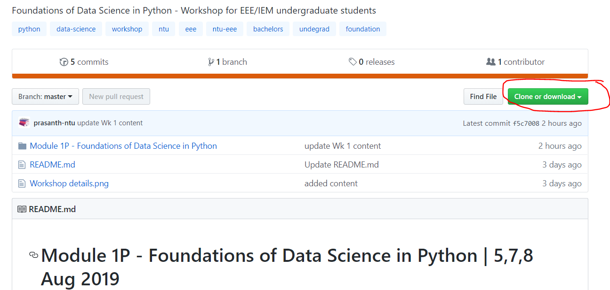
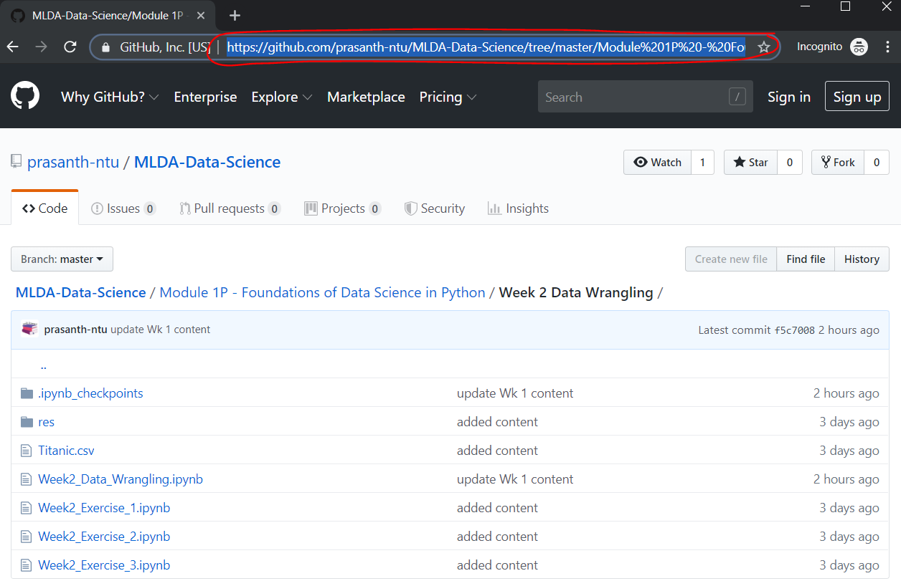

# Module 1P - Foundations of Data Science in Python | 5,7,8 Aug 2019

<!-- TOC depthFrom:1 depthTo:6 withLinks:1 updateOnSave:1 orderedList:0 -->

- [Module 1P - Foundations of Data Science in Python | 5,7,8 Aug 2019](#module-1p-foundations-of-data-science-in-python-578-aug-2019)
- [Topics Covered](#topics-covered)
	- [Session 1 - Programming in python](#session-1-programming-in-python)
	- [Session 2 - Data Wrangling](#session-2-data-wrangling)
	- [Session 3 - Exploratory Data Analysis](#session-3-exploratory-data-analysis)
	- [Session 4 - Data Science in the Real World](#session-4-data-science-in-the-real-world)
	- [Session 5 & 6 - Mini-projects](#session-5-6-mini-projects)
- [Steps to follow:](#steps-to-follow)
	- [Step 1 - Logging into coding environment](#step-1-logging-into-coding-environment)
		- [Step 1a - Logging into Google Colab](#step-1a-logging-into-google-colab)
		- [Step 1b - Jupyter Notebook in Browser](#step-1b-jupyter-notebook-in-browser)
		- [Step 1c - Jupyter Notebook Installation](#step-1c-jupyter-notebook-installation)
	- [Step 2 - Opening a notebook](#step-2-opening-a-notebook)
- [Miscallaneous](#miscallaneous)
	- [Download Github folder](#download-github-folder)

<!-- /TOC -->

# Topics Covered
## Session 1 - Programming in python
- Intro to Jupyter Notebook | Intro to Python | Intro to Pandas - [ipynb code](Module%201P%20-%20Foundations%20of%20Data%20Science%20in%20Python/Week%201%20Programming%20in%20Python/Week1_Programming_in_Python.ipynb)
- Practise Session
  - Exercise 2 - [ipynb code](Module%201P%20-%20Foundations%20of%20Data%20Science%20in%20Python/Week%201%20Programming%20in%20Python/Week1_Exercise_2.ipynb)
  - Exercise 3 - [ipynb code](Module%201P%20-%20Foundations%20of%20Data%20Science%20in%20Python/Week%201%20Programming%20in%20Python/Week1_Exercise_3.ipynb)

## Session 2 - Data Wrangling
- Data Basics | Missing Data | Merging and Grouping - [ipynb code](Module%201P%20-%20Foundations%20of%20Data%20Science%20in%20Python/Week%202%20Data%20Wrangling/Week2_Data_Wrangling.ipynb)
- Practise Session
  - Exercise 1 - [ipynb code](Module%201P%20-%20Foundations%20of%20Data%20Science%20in%20Python/Week%202%20Data%20Wrangling/Week2_Exercise_1.ipynb)
  - Exercise 2 - [ipynb code](Module%201P%20-%20Foundations%20of%20Data%20Science%20in%20Python/Week%202%20Data%20Wrangling/Week2_Exercise_2.ipynb)
  - Exercise 2 - [ipynb code](Module%201P%20-%20Foundations%20of%20Data%20Science%20in%20Python/Week%202%20Data%20Wrangling/Week2_Exercise_3.ipynb)

## Session 3 - Exploratory Data Analysis
- Matplotlib Basics | Plot from Pandas - [ipynb code](Module%201P%20-%20Foundations%20of%20Data%20Science%20in%20Python/Week%203%20Exploratory%20Data%20Analysis/Week3_Exploratory_Data_Analysis.ipynb)
- Practise Session
  - Exercise 1 - [ipynb code](Module%201P%20-%20Foundations%20of%20Data%20Science%20in%20Python/Week%203%20Exploratory%20Data%20Analysis/Week3_Exercise_1.ipynb)
  - Exercise 2 - [ipynb code](Module%201P%20-%20Foundations%20of%20Data%20Science%20in%20Python/Week%203%20Exploratory%20Data%20Analysis/Week3_Exercise_2.ipynb)  

## Session 4 - Data Science in the Real World
- Data science work flow | Case study: conversion rate analysis - [ipynb code](Module%201P%20-%20Foundations%20of%20Data%20Science%20in%20Python/Week%204%20Real%20World%20Case%20Study/Week4_Real_World_Case_Studies.ipynb)

## Session 5 & 6 - Mini-projects
- Mini project 1 - Movie
- Mini project 2 - Student Grade
- Mini project 3 - Camera

# Steps to follow:
## Step 1 - Logging into coding environment
### Step 1a - Logging into Google Colab
** If you don't have a google account, skip to Step 1b **
- Go to [https://colab.research.google.com](https://colab.research.google.com)
- Sign in to your google account
- If you are new to google colab notebook, watch this Youtube video -  [Get started with Google Colaboratory (Coding TensorFlow)](https://youtu.be/inN8seMm7UI)

### Step 1b - Jupyter Notebook in Browser
** If the notebook disconnects/ dies often, consider Step 1c. Many students have reported that that connection is not stable**
- Go to [https://jupyter.org/try](https://jupyter.org/try)
- Click on "Try Jupyter with Python". This will launch an online jupyter notebook using binder

### Step 1c - Jupyter Notebook Installation
- If you want to install jupyter notebook into your computer,
	- Go to [https://www.anaconda.com/distribution/](https://www.anaconda.com/distribution/),
	- Download `Anaconda` and
	- Install it
	- Click `Start > Anaconda > Jupter Notebook` (in Windows)

## Step 2 - Opening a notebook
- Click `File > New Python 3 Notebook` to create a new `.ipynb` file online
- Wondering what's a notebook?
    - Think of it like a word document where you can write your python code, run and see the outputs, add comments and notes, insert images, etc. in one place.

# Miscallaneous
## Download Github folder
- To download entire github repository, click on `Clone or Download > Download Zip`

- To download a specific folder in github repo,
	- Copy the folder url as shown below and

	- Go to [https://minhaskamal.github.io/DownGit/](https://minhaskamal.github.io/DownGit/#/home) and Paste the url 
	- Hit `Download` to download the folder/file
